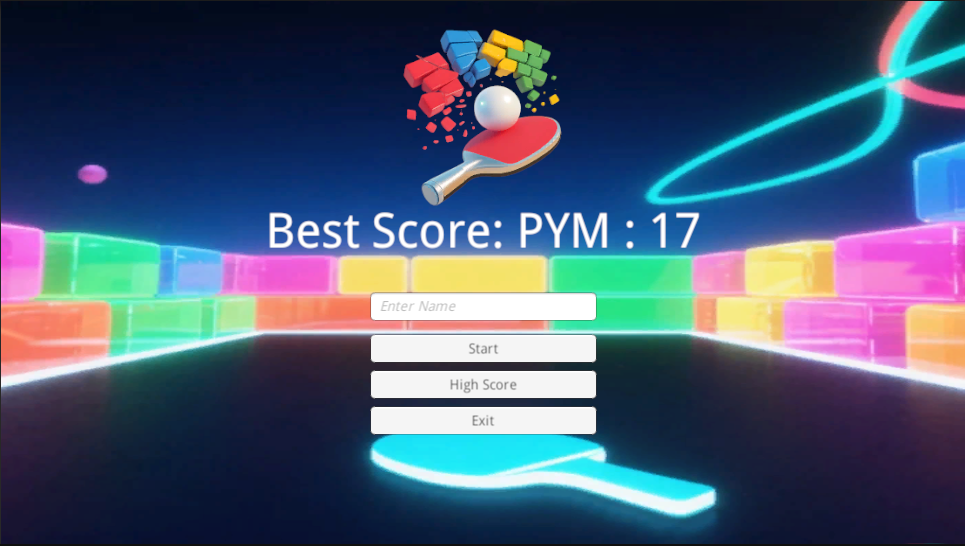
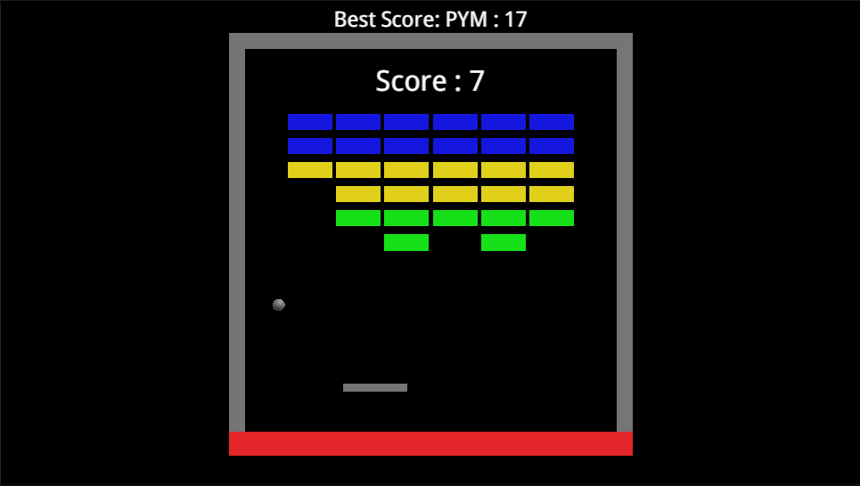
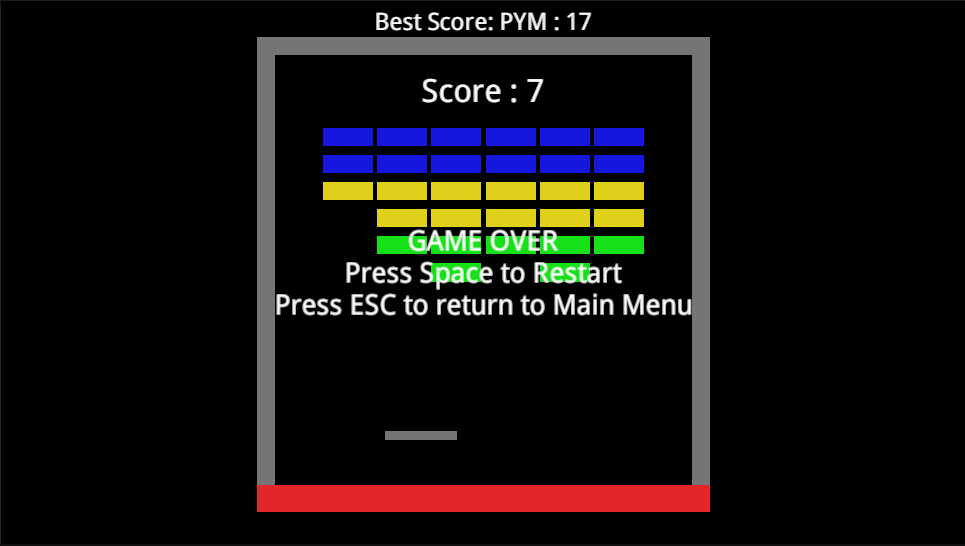
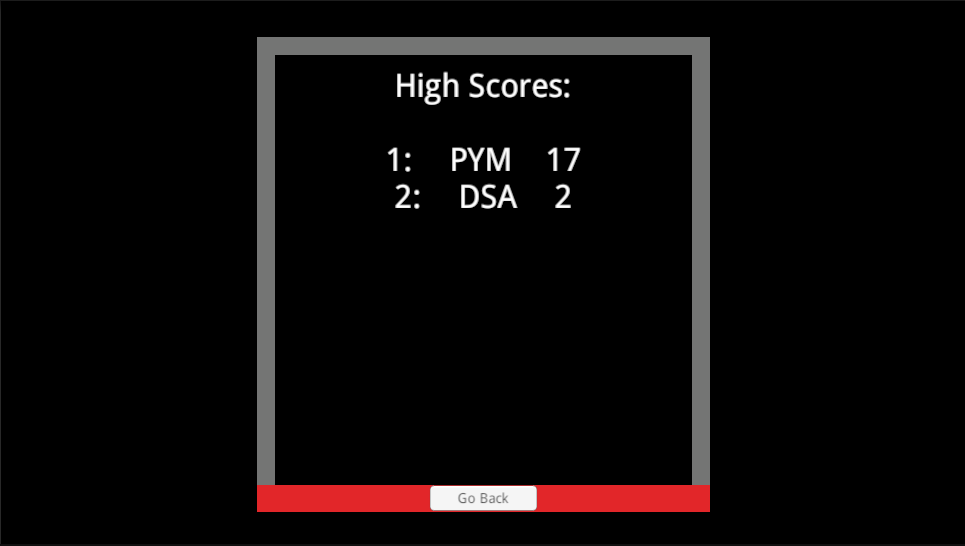

    

# Data-Persistence-Project
A Unity Learn project demonstrating data persistence concepts, done as exercise of the Junior Programmer pathway.

## Screenshots

*Main menu with player name input and high score display.*

*Breakout gameplay with real-time score tracking.*

*Game over screen showing final score and high score.*

*High Score screen showing all players scores.*

## Key Features

- Saves and loads high scores using JSON serialization.
- Classic breakout gameplay with real-time score tracking.
- Clean UI for entering and displaying player names and scores.
- Follows Unity Junior Programmer best practices.
- Easily extendable for new features or customization.
