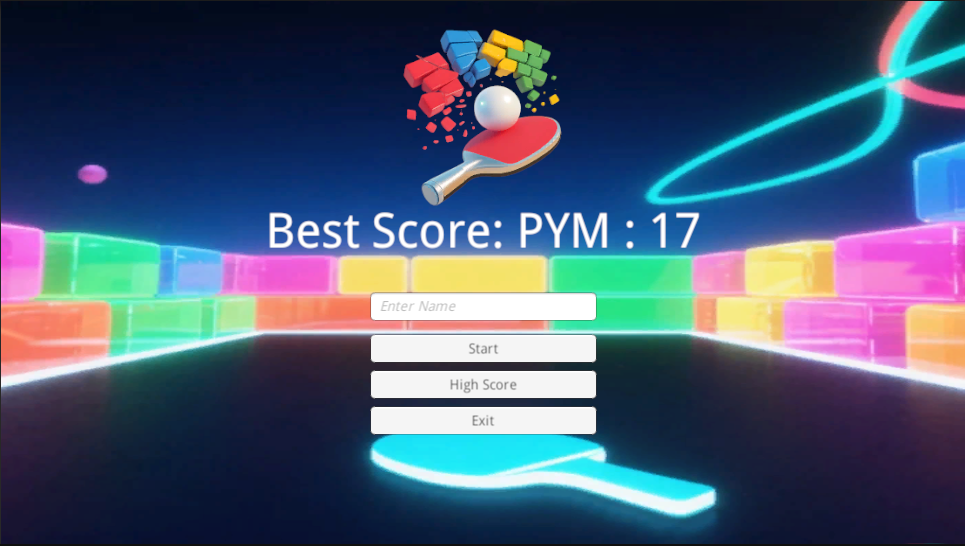
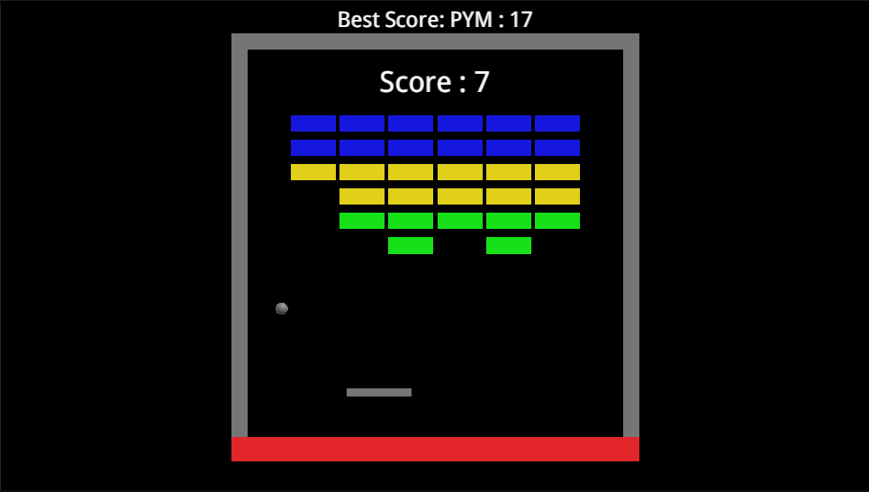
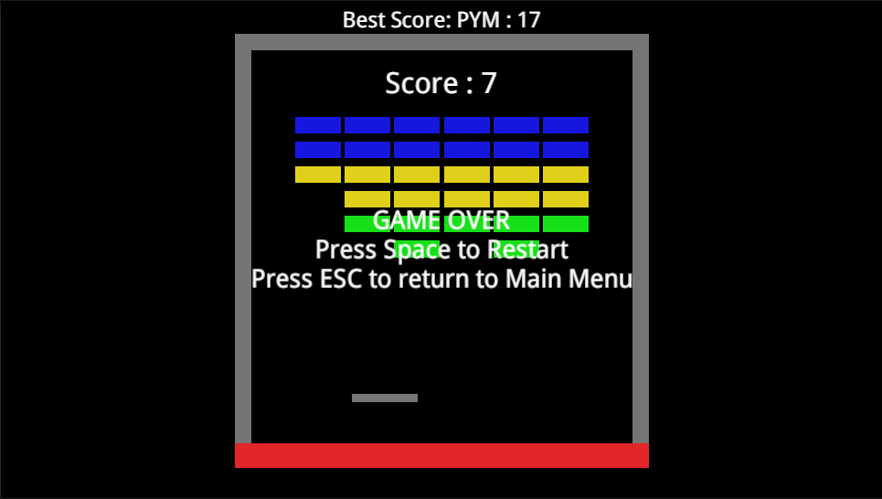
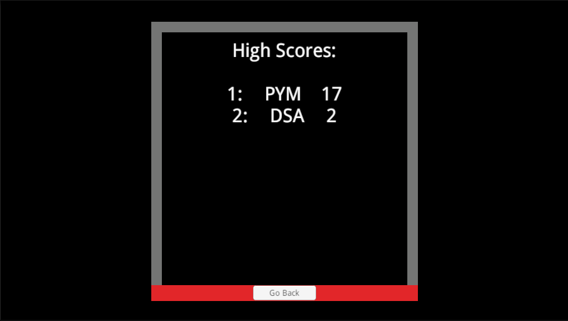

    

# Data-Persistence-Project

A Unity Learn project demonstrating data persistence concepts, done as exercise of the Junior Programmer pathway.

## Key Features

- Saves and loads high scores using JSON serialization.
- Classic breakout gameplay with real-time score tracking.
- Clean UI for entering and displaying player names and scores.
- Follows Unity Junior Programmer best practices.
- Easily extendable for new features or customization.

## Demo Video

Watch a short gameplay demo:

## Screenshots

_Main menu with player name input and high score display._

_Breakout gameplay with real-time score tracking._

_Game over screen showing final score and high score._

_High Score screen showing all players scores._

